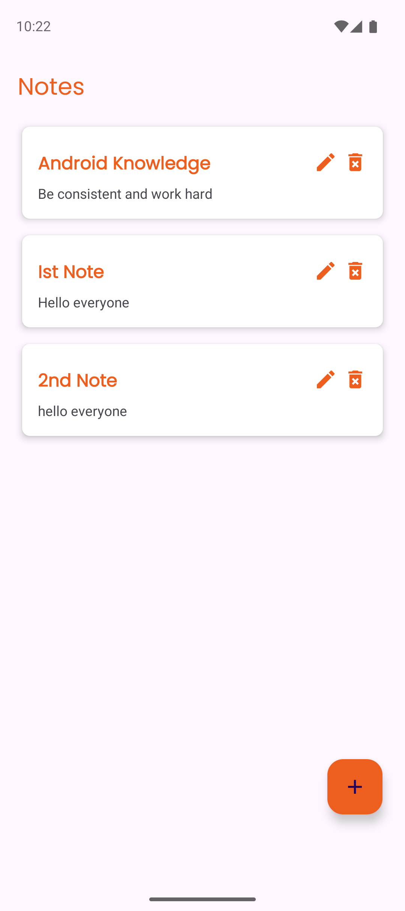

# Notes App

A simple and clean Android Notes app built with Kotlin, designed to help you take, update, and delete notes efficiently with a beautiful UI.

## Screenshots and Demo

[Demo Video](Screenshots/Screen_recording.mp4)

## Features

- Create and save notes
- Edit existing notes
- Delete notes with confirmation
- Dark theme supported
- Easy-to-use and minimal interface

## Technologies Used

- Kotlin
- Android Jetpack Components (LiveData, ViewModel, Room)
- Material Design
- SQLite/Room for local storage
